# Minimal Example

## Description
This repository has a minimal example to reproduce the error of EPackage registry by Eclipse Epsilon operation.

## Technical Requirements

* Java Development Kit v8
* Eclipse Neon. Include this Plugins:
	* Eclipse Epsilon 1.3
	* Eclipse Sirius 4
	* OCLTools
	* GMF
	* EEF
	* Acceleo

## Contents

This repository has 4 projects, the most important is "EPackageRegistryExample" in which has the core assets to reproduce the error. The others projects are a complement to has a Sirius Editor.

In this order of ideas, "EPackeageRegistryExample" has a folder called "Core" that contents:

* MetamodelSetterExampl.eol -> code to register EPackager by EOL script.
* SiriusSpecsCorrectExample.xmi -> It's a specs model of Eclipse Siruis with a correct configuration of metamodels.
* SiriusSpecsGenerated.xmi -> It's a specs model of Eclipse Siruis that will use has input of the EOL script, that has not a metamodels configuration.
* SimpleOO.ecore -> It's a metamodel that will add as metamodel configuration in the Sirius specs.
* DatasetForSiriusTest.xmi -> It's dynamic instance from SimpleOO.ecore. This will use to test the Sirius Editor with the metamodels configuration.
* backup -> i't s a folder that contents backups of: a DatasetForSiriusTest.xmi and SiriusSpecsGenerated.xmi.

## Process to Reproduce Error

**Step 1:** Import Projects.

1. Import all projects in your Eclipse Instance.
2. Open the Principal project "EPackageRegistryExample".
3. Open the folder "Core".
4. Register SimpleOO.ecore with right-click.

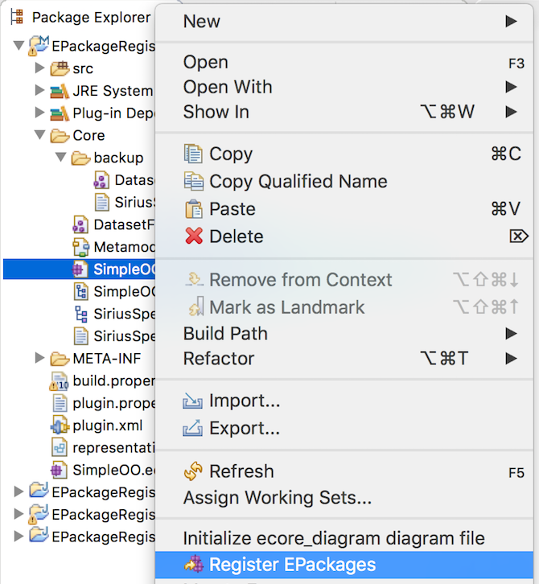

**Step 2:** Check Ecore Estructure

1. Open SimpleOO.ecore file.
2. Check Ns URI configuration to have idea of the correct result.

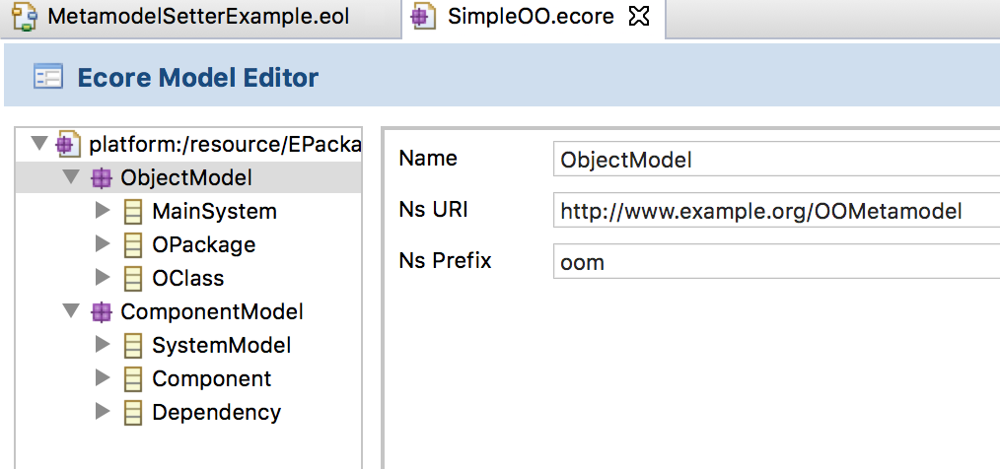

**Step 3:** Open SiriusSpecsGenerated.xmi

1. With right-click, open the file "SiriusSpecsGenerated.xmi" with the Text Editor.
2. Verify that has not any metamodel tag.

If the correct must see it like this:
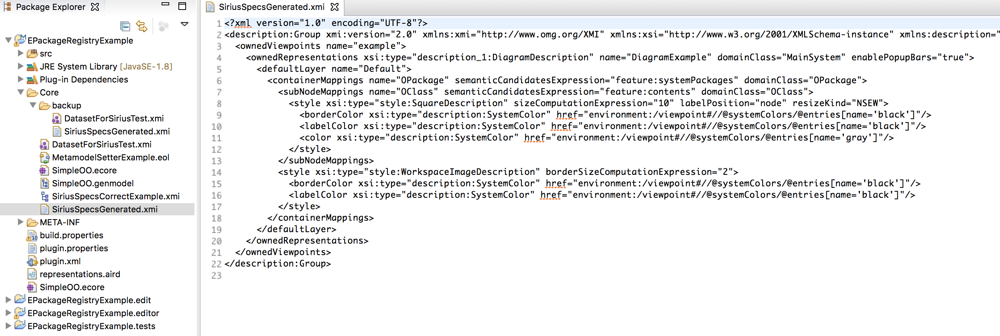

**Step 4:** Open MetamodelSetterExample.eol

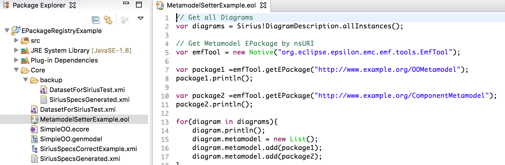

1. Open the file called "MetamodelSetterExample.eol".
2. Consider the following:
	* This script calls a java native class called "EmfTool", this class allows to get EPackages registered on the EMF Registry.
	* In the line 7 and 10, we get two EPackage from the EMF Registry with the NsUri of each one.
	* In the line 16 and 17, we add the epackages as metamodels required for the Sirius specs.
3. Close the file and pass to the next step.

**Step 5:** Configure EOL Program.

1. Open the Runs Configuration of the Eclipse.
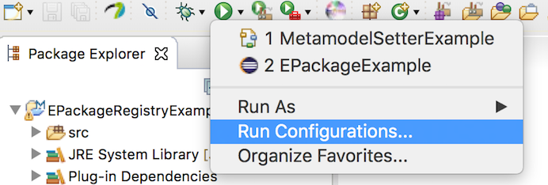

2. With double-click, create a new configuration for a "EOL Program", set source configuration the file "MetamodelSetterExample.eol" and set the name with "MetamodelSetterExample".
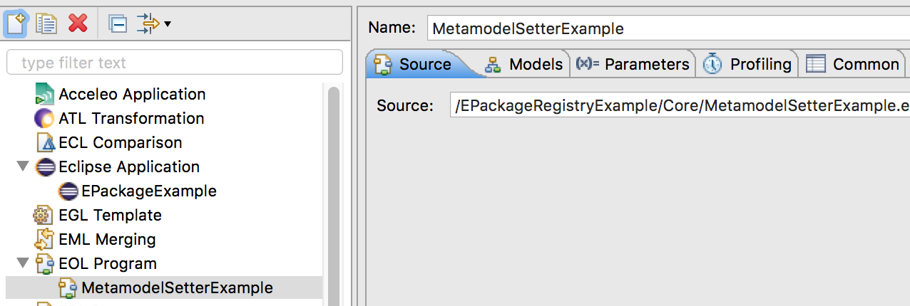

3. Open the models tab and add a new model with this configuration.

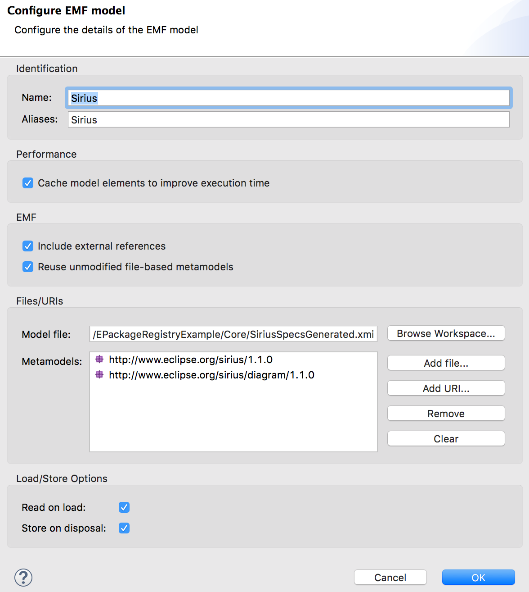

4. As result you will has this.

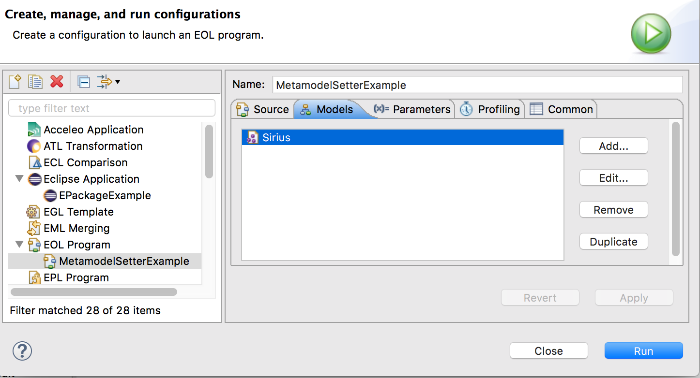

**Step 6:** Run EOL Program

1. Click on the buttom "run" and the console will print this:
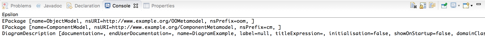

**Step 7:** Compare the result.

1. Check in the file "SiriusSpecsGenerated.xmi" with the text editor, and you will find this tags:
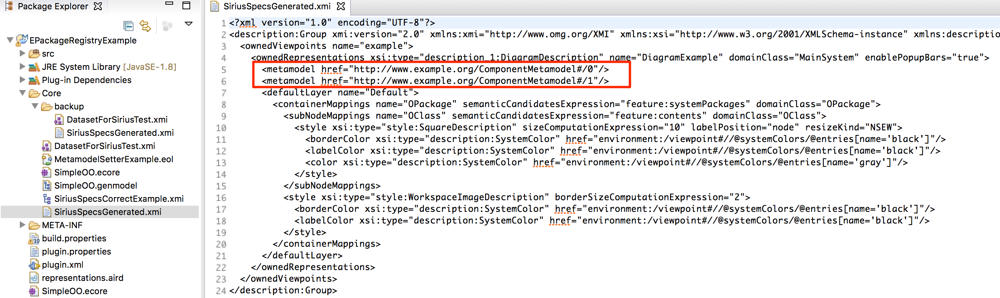

2. Now, open the file "SiriusSpecsCorrectExample.xmi" and find the same tags.

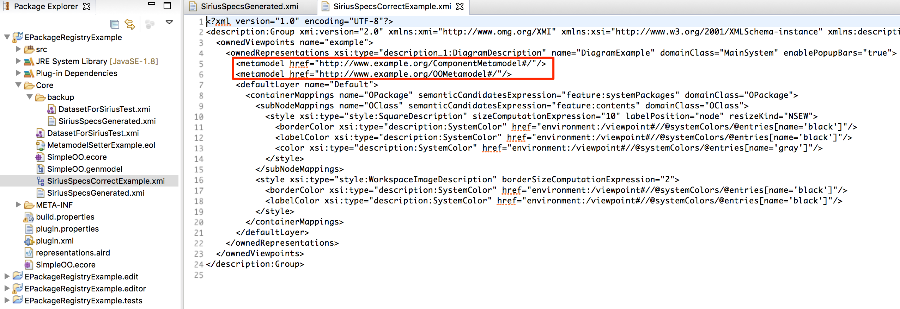

> **This is the problem, the URI are not the same. I guess because the second file ("SiriusSpecsCorrectExample.xmi") was configurated manually and in a second instance of Eclipse with the Sirius Editor as a plugin, therefore, it hasn't the same runtime and that make a reference with a different URI.**

**Step 8:** Test Sirius Specs.

1. In run configuration, create a Eclipse Application and run this as a second instance.
2. In the second instance, create a Modeling Project called "Example".
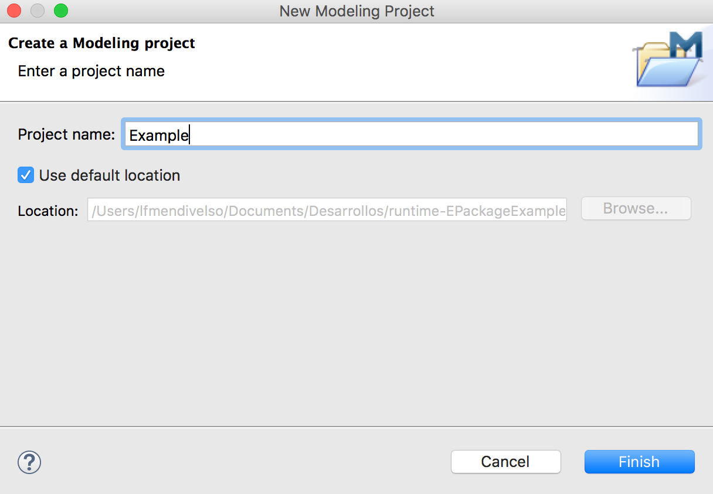
3. Copy the files SiriusSpecsCorrectExample.xmi, SiriusSpecsGenerated.xmi and DatasetForSiriusText.xmi.
	* Change the extension of SiriusSpecsCorrectExample.xmi to SiriusSpecsCorrectExample.odesign
	* Change the extension of SiriusSpecsGenerated.xmi to SiriusSpecsGenerated.odesign
	* Open the file SiriusSpecCorrectExample.xmi.
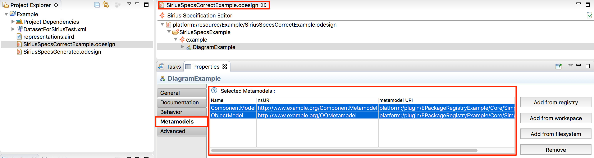

> Valite the metamodel configuration as the image example.

4. Open the file SiriusSpectGenerated.xmi, and validate metamodel configuration, and you will has this.
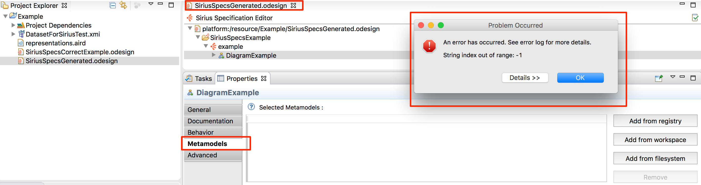
